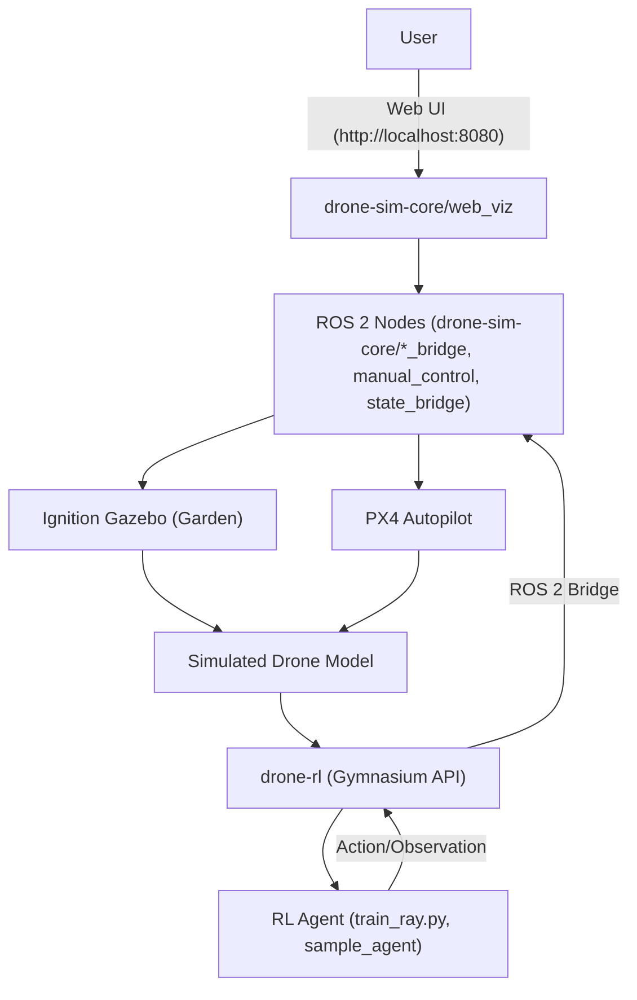

# drone_avoidance_rl

[](https://github.com/drone_avoidance_rl/drone_avoidance_rl/actions)
[](https://github.com/drone_avoidance_rl/drone_avoidance_rl/actions)
[](./LICENSE)
[](https://github.com/drone_avoidance_rl/drone_avoidance_rl/releases)

> **Note:** Replace `<OWNER>/<REPO>` with your actual GitHub repository path.

---

## Project Architecture



---

## Simulation Demo


> Replace this GIF with an actual simulation capture.

---

## Quick Start

1. **Clone the repository:**
   ```sh
   git clone https://github.com/<OWNER>/<REPO>.git
   cd drone_avoidance_rl
   ```
2. **Start all services with Docker Compose:**
   ```sh
   docker-compose up --build
   ```
3. **Access the Web UI:**
   - Open [http://localhost:8080](http://localhost:8080) in your browser.
   - The simulation and RL environment will be available via the web interface.

4. **(Optional) Run tests:**
   ```sh
   docker-compose exec <service> pytest
   ```

---

# [Japanese README](README_ja.md)

# drone-rl

Reinforcement learning environment for drones (OpenAI Gym API, ROS 2 integration, domain randomization supported)

> **Note:** All main source files are located in the `drone-rl/` directory. If running examples from the repository root, set `PYTHONPATH=drone-rl` or run scripts from within the `drone-rl/` directory.

## Overview

This repository provides a reinforcement learning (RL) environment for autonomous drone control, avoidance, and navigation.
- Compatible with OpenAI Gymnasium API
- Distributed training and vectorized environments via Ray RLlib
- ROS 2 Humble / simulator integration
- Domain randomization (initial position, target, mass, wind)
- Tested, CI-ready, Docker support

## Main Files
- `drone_sim_env.py`: Main Gym environment for RL (reset/step/render/close, ROS2 integration, randomization)
- `gym_env.py`: Environment registration and creation utilities
- `ros_interface.py`: Singleton for ROS2 topic integration
- `train_ray.py`: Training script for Ray RLlib (PPO, env_config support)
- `vector_env_example.py`: Example for vectorized environments
- `tests/`: API and specification tests

## Environment Specification

### Observation Space
```python
Box(low=-inf, high=inf, shape=(10,), dtype=np.float32)
# [x, y, z, roll, pitch, yaw, vx, vy, vz, battery]
```

### Action Space
```python
Box(low=[0,-1,-1,-1], high=[1,1,1,1], dtype=np.float32)
# [thrust, roll, pitch, yaw_rate]
```

### Reward/Done
- Reward: `-distance_to_target - 0.1*speed + 0.05*height`
- Done: distance < 0.5m, height < 0.2, battery < 0.05, speed > 25, out of bounds, max steps
- info: `{"distance", "speed", "battery", "height", "step"}`

### Domain Randomization
- Use `randomization_params` to randomize initial position, target, mass, wind
- Example: `{"init_pos_range": [[-2,-2,3.5],[2,2,4.5]], ...}`

## Usage

### Dependencies
- Python 3.10+
- gymnasium==1.0.0, numpy, torch>=2.0, ray[rllib]==2.47.1, tensorboard, pytest
- ROS2 (optional)

### Environment Registration & Testing
```bash
pip install -r requirements.txt
python -c "from gym_env import register_drone_env; register_drone_env()"
pytest tests/
```

### Basic Usage Example

```python
from gym_env import create_env
env = create_env(target_pos=[5,0,4], init_pos=[0,0,4], use_ros=False)
obs, info = env.reset()
done = False
while not done:
    action = env.action_space.sample()
    obs, reward, terminated, truncated, info = env.step(action)
    done = terminated or truncated
env.close()
```

### Ray RLlib Training
```bash
python train_ray.py --num-workers 2 --train-iterations 10 \
  --target-pos 5 0 4 --init-pos 0 0 4 --randomize
```

### Vectorized Environments
```python
from gymnasium.vector import AsyncVectorEnv
from drone_sim_env import DroneSimEnv

def make_env(i):
    return lambda: DroneSimEnv(instance_id=i, use_ros=False)
num_envs = 4
env = AsyncVectorEnv([make_env(i) for i in range(num_envs)])
obs = env.reset()
...
```

### Docker
```bash
docker build -f docker/rl-agent/Dockerfile -t drone-rl:gpu .
docker run --gpus all -v $(pwd)/results:/workspace/results drone-rl:gpu \
  python train_ray.py --num-workers 4 --train-iterations 100
```

## ROS2 Integration
- Communicates with the simulator via `/drone0/state` (DroneState) and `/drone0/control` (DroneControlCommand)
- Standalone operation possible with `use_ros=False`
- `ros_interface.py` abstracts publish/subscribe

## Running Tests
- Run `pytest tests/` to comprehensively verify API, specifications, randomization, termination conditions, and dummy operation

## Extending the Environment
- Easy to add image sensors, multi-drone support, custom rewards, CI auto-verification, etc.

## Contributing
- Pull requests are welcome. New algorithms, agents, and benchmarks are also encouraged.

## Security Scanning (CodeQL)

- This repository enables only a custom CodeQL workflow via GitHub Actions (`.github/workflows/codeql-analysis.yml`).
- GitHub's "default setup" CodeQL is disabled (cannot be used together).
- Please continue to use "custom workflow only".
- Trivy vulnerability scanning is also used, but is categorized separately and does not conflict. 